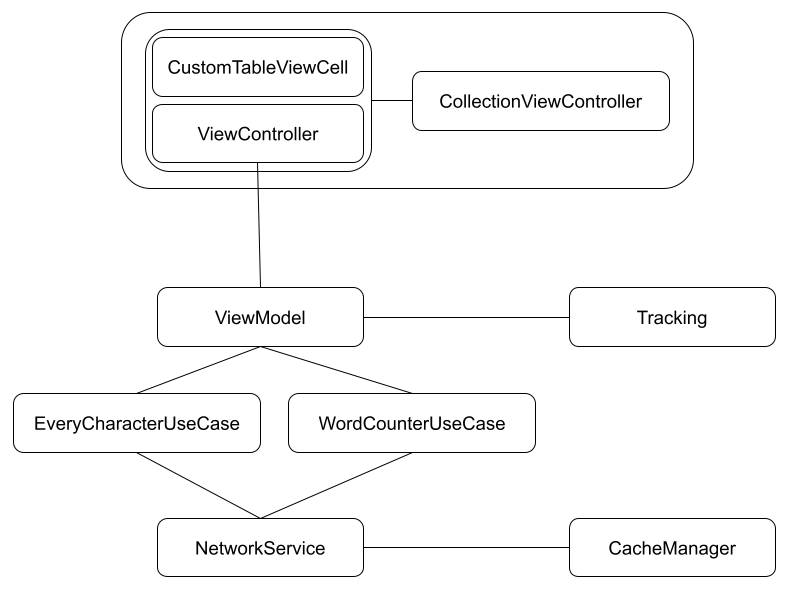
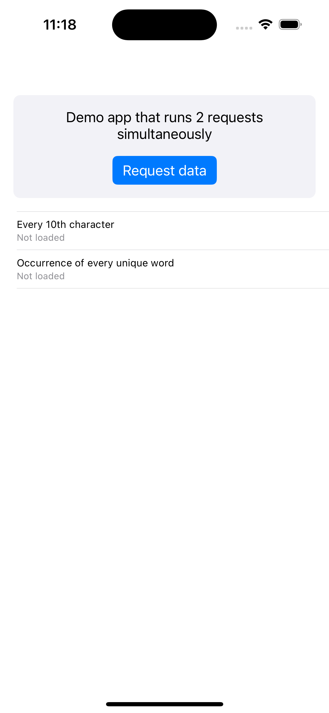
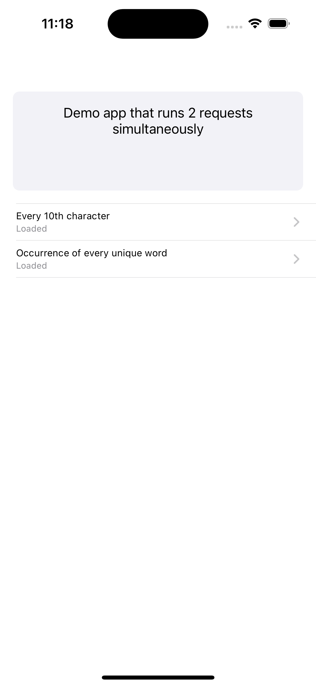
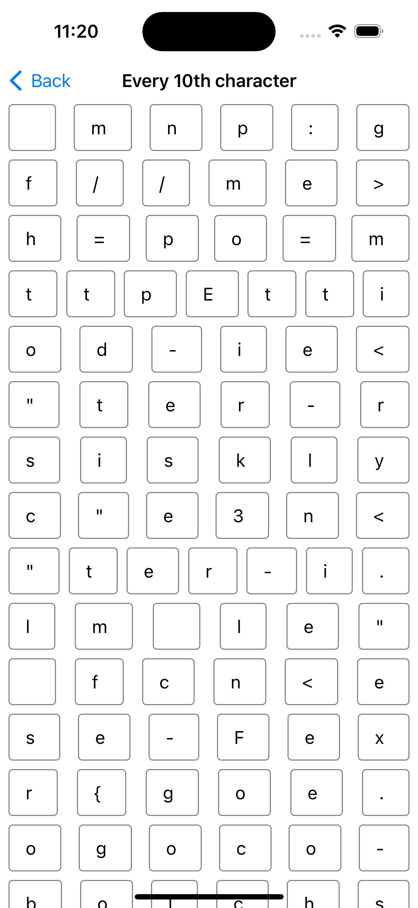
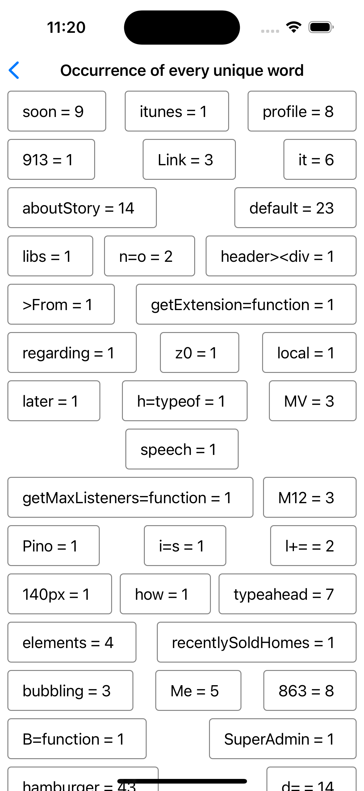

# Challenge

Write a Simple application that defines and runs 2 requests simultaneously, each request is defined below:
 
Every10thCharacterRequest:
Grab content from the web
Find every 10th character (i.e. 10th, 20th, 30th, etc.) and display the array on the screen 
 
WordCounterRequest:
Grab content from the web
Split the text into words using whitespace characters (i.e. space, tab, line break, etc.), count the occurrence of every unique word (case insensitive) and display the count for each word on the screen 

The application should:
1. Show a single Button to run the two requests simultaneously
2. Show the results of each request above as soon as the processing of the corresponding request finishes, displayed in views showing the resulting lists. The way the UI is presented is up to your discretion
3. Data should be cached and made available offline after the first fetch 
4. The code should be unit tested

 
## Tech Stack

**Language:** Swift

**Architecture:** MVVM

**Frameworks:** UIKit, Foundation, Combine

**Tests:** Unit test, UI tests

## Screenshots

## Author

Matias Leandro Martin Roldan

roldanmatias@gmail.com

https://www.linkedin.com/in/roldanmatias/

